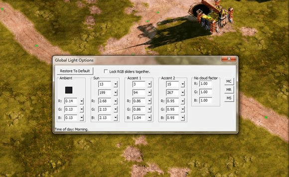
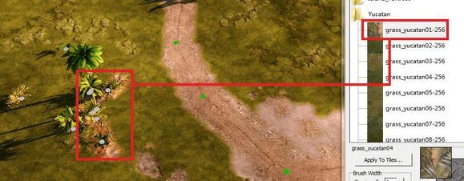

# 【地图美化教程第一期】无限岛（纯草地）风格

## 构建地形

>作者：未来平定者x1

- 新建一个地图，命名，保存。
- 用高度笔刷工具勾勒出想要的地形。其中海底最低一层建议高度60，海底140，陆地第一层210，第一次向上每升高一级悬崖高度则笔刷高度增加70（即悬崖地形块高度为70）。
- 用湖泊/海洋工具添加水域，并将水域高度[Water Height]调整到197~201之间的数值。
水域的设置：在高画质下水域是通过带颜色倒影和无色水叠加表现的，因此倒影[Reflection On]这一选项必须打钩，否则高画质水会变成无色；同时水域高度要和倒影高度吻合，因此水域高应在197~201之间（200左右）
- 用过渡笔刷工具给沙滩和水域的高度之间加上平缓过渡。
过渡是否能通行：按Ctrl+I可以调出通行区域模式，红色方块表示不能通行。

以上步骤做完后，保存一次地图。

## 地图颜色分区和过渡
- 打开物品工具，找到REGIONS-YUCATAN-OPTIMIZED_PROPS，找到YU_Cliff放置在地图上构建第二层。
悬崖放置：Cliff后带Elevation2的（MOD SDK 1.12版本）为2层高度的悬崖（140）。摆放悬崖时建议开启网格放置模式（Ctrl+Alt+G），因为尤卡坦的悬崖接缝是按网格的。
- 悬崖块摆出地形后，用高度为280的笔刷填充第二层悬崖。
- 用绿色草地填充第一层，黄色草地填充第二层，白色沙地填充沙滩和海域。

- 用过渡地表给沙滩和第一层做上过渡。
对过渡色有时候导致贴图紊乱的解决办法：另选一种贴图用油漆桶倒在导致紊乱的贴图上，然后换回贴图笔刷，用贴图覆盖掉有其他颜色的那片区域。
- 将笔刷调到“可见性”模式[Visibility]，点不可见，刷掉悬崖块上突出的地形。
- 选择岩石和过渡色在悬崖下刷上过渡。

以上步骤做完后，保存一次地图。

## 调节光照
**极其重要的一节！地图气氛就是此刻出来。**

光照按以下顺序依次说明（后面的数值是一般地图建议数值）：
【Restore to Default】回复到地图初始光照
【Ambient（阴影）】
R-红 0.1~1
G-绿 0.1~1
B-蓝 0.1~1
【Sun（日光）】
日光倾斜角度 0为夜晚，90为垂直，数值越大影子越短，光照越亮。
日光照射方向 359和0皆为从正左方向向正右照射，90为从下方向上照射。
R-红 0.5~2.5
G-绿 0.5~2.5
B-蓝 0.6~2.7
注意：光照太倾斜会使轻小物体（比如灌木，栏杆以致树等）的影子飘离物体造成虚假感。
【Accent 1/2】
同太阳光原理。注意调节补光不能使物体出现黑色（没有光照到）的地方。
可以在地图上先放个诸如盟军建造厂啊什么的建筑，一边调节光照一边转动摄像机观察是否合适。
【No Cloud Factor】
暂时没发现有什么用。欢迎补充。

## 在地图上摆放物体
物体主要是以下：
### 树木
- Havana_HV - Destructible_ProPs - HV_Trees 1~2
- Cannes_CA - Destructible_ProPs - CS_Palm 1~2
### 灌木，草
- Cannes_CA - Destructible_ProPs - CS_Palm 3
- Heidelberg_HB - Optimized_ProPs - HB_Grass 1~3
- Yucatan_YU - Optimized_ProPs - YU_Bush 1~3
- Brighton_beach_BB - Optimized_ProPs - CC_Grass 7
### 岩石
- Yucatan_YU - Destructible_ProPs - YU_LargeRocks 1~3
- Yucatan_YU - Optimized_ProPs - YU_SmallRocks 1~2
### 竹栏杆，海滩遮阳伞
- Yucatan_YU - Destructible_ProPs - YU_BambooFence 1~2
- Yucatan_YU - Destructible_ProPs - YU_BeachUmbrella 1~2
### 草房（无限岛上的那种）
- Heidelberg_HB - Structure - YU_TikiHut 01

摆放时记住错落有致，不要在一个地方堆砌大量同样物体。
以上步骤做完后，保存一次地图。
【补充陆地地表】

在树木的下面添加一些落叶地表贴图。

## 海底美化
对于很多人来说海底美化就是笔刷弄个高低，或者随便涂点颜色（包括我以前的新手时期）
但是如果海底美化很渣的话，对于高画质来说就是折磨。同时海底也是地图美化极重要的一部分。
- 用增加高度笔刷给海底错落地（或者有走向的）添加高低。笔刷大小建议2~3，羽化范围1~3，高度10.

- 在距沙滩一段距离的地方刷上深色海底。在深色和沙滩之间添加浅色海底过渡，注意不要太过于平齐。

- 用珊瑚礁贴图和珊瑚礁-深色海底过渡贴图在海底凸起处沿脊描绘珊瑚礁，注意不要过多。
- 用浅色海底在靠近沙滩的珊瑚礁间做不规则描画点缀。
- 用最深色海底在靠近深海方向的深色海底基础上加深一层颜色。

- 将靠近地图边缘的海底高度用高度笔刷降低到40，笔刷羽化调5.斜面用岩石贴图描绘，高度40的海底用油漆桶倾倒上最深色海底，注意在倒之前确认用岩石贴图把到的区域围完全了。
- 添加物体。主要在：
### 沉船
Yucatan_YU - Destructible_ProPs - YU_SunkenShip 1~5
### 珊瑚礁
Yucatan_YU - Optimized_ProPs - YU_Coral 1~4
### 岩石
Yucatan_YU - Optimized_ProPs - YU_SmallRocks 1~2

珊瑚礁沿刷出的底色摆放，石块随意，沉船不要太多。

## 音效点
其实很多人说这个没什么大用，因为一般听不见。
但是怎么说这是地图精细化的一部分。

音效点位置：ByNativeType-Neutral-Audio 根据英文说明添加。
## 波浪
可有可无。波浪工具拉一条线，点击一头，命名为FXShorelineDense01

保存地图，美化到这里基本上就完成了。根据自己的需要可以做适当调整。

## 提问
Q：问个细节，怎样刷YUCATAN - Dirtroad旁的地表好看些
A：用4-5的笔刷直接在下面沿着小路刷gravel那个贴图就可以啦。有的地方（比如道路交叉）可以刷一些dirt-yucatan06-256 ，类似于矿脉前面那样
Q：还有，就是柔化地表的顺序是怎样？我是在gravel外刷dirt-yucatan06，在gravel中用尺寸1的刷dirt-yucatan06，然后柔化gravel，这时候外面的dirt-yucatan06就没有办法充分柔化了
A：小笔刷涂上去的，或者在里面的一般是优先柔化，如果先外面的话里面的就太小了
Q：就是先刷外面dirt-yucatan06么。或者还有一个方案：先刷并柔化gravel，然后在gravel外面刷dirt-yucatan06并柔化，这样我担心会出现地表残渣的BUG
A：路下面一般就gravel就行了，如果要刷dirt也可以。残渣其实可以手动处理的，如果处理不掉可以拿个石头或者草挡一下
