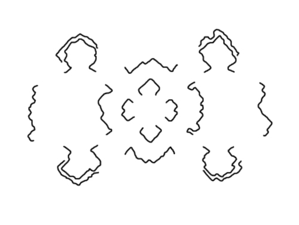

# 【教程】小地图制作教程简易版

> 作者： 未来平定者x1

在确认你的编辑器已经显示边界后，按Ctrl+F放到俯视图模式，拉高，截图。截之前顺便把显示水域关掉以防倒影阻碍视线。我们以官方地图原始神庙为例：

打开任何画图软件，去掉黄色方框外的东西，留下地图视界以内的部分。

打开Photoshop任意版本，把原来那图按比例缩小，并新建一个大小相同的空白幕布，大小最好控制在500*500以下。【图像-图像大小】【文件-新建】
然后，在截图的那个图像上新建一个图层【图层-新建图层】
适当放大图片后，用黑色画笔沿地图边线描绘，像素3-4

> 描边看不清的话，放大图片

描绘完成后，拖到那张空白幕布上去。

用吸色管吸取官方地图表的颜色，给原来的地图上色。

完成稿。如果觉得不满意，可以适当复制图层及模糊。海岸线的外缘用模糊工具处理一下。

导出为TGA文件，文件名为你的地图名+_art。
