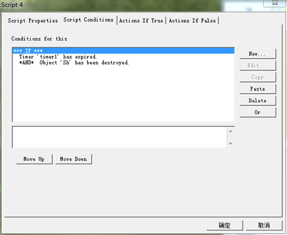
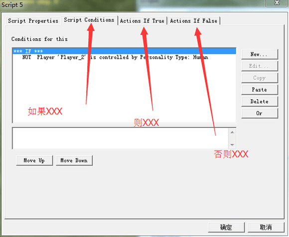

# 【教程】编辑器中的逻辑和实现方法

>作者：物wwu

## 首先说说最基本的3中逻辑：与，或，非以及他们在编辑器的条件脚本的实现方法                             
与逻辑的实现方法最简单，在条件脚本中复制一条脚本，在粘贴，就产生了与逻辑，复制后的脚本内容可以编辑                   

或逻辑 要产生第一个OR，点击最上面的IF，然后点击右边的OR按钮，产生第一个OR逻辑，然后单击任何一条条件脚本，复制粘贴，便会在那个OR的下一行出现一条脚本
若要产生多个OR逻辑，点击框内最后一个OR，然后再点击右边的OR按钮

！！！需要注意的是，编辑器的OR逻辑是A+B+C+.......类型的，也就是说，并不提供括号功能，无法直接实现（A+B）*C这样形式的逻辑（！注意，并不是说不能实现这个逻辑，只是无法按照这个形式！）

非逻辑 自定义地图无法直接实现非逻辑，虽然有那个选项但是选了并没有用，必须从官方任务地图脚本中复制过来，那条脚本会一直保持非逻辑，无论内容如何变

## 为了进一步说更复杂的逻辑，先稍微普及一点逻辑方面的相关知识                        
用A，B，C。。。表示事件（在此处即表示每一条脚本）                        
3种基本逻辑的表示方法                        
A*B 表示 A与B（或者说A且B）                        
A+B 表示 A或B                        
^A 表示 非A （懂的别说，我找不到那个符号，所以用这个代替）                                             

若有3条脚本参与逻辑，则编辑器表示的逻辑形式可以概括为ABC+AB(^C)+A(^B)C+(^A)BC+........这样的，逻辑上吧每个+号之间的式子成为最小项                     
也就是说，编辑器能表示的逻辑形式都是最小项之和                     
像前面提到的逻辑式（A+B）*C，虽然无法从这个形式实现此逻辑，但是将此式子做一化简                     
（A+B）*C=A*C+B*C 而这样的逻辑形式编辑器是能够实现的                     

下面示例一些复杂的逻辑的实现方法             
与非逻辑：^(A*B) 即先A与B，再将结果取非（或者说取反)             
而 ^(A*B)=(^A)+(^B)             
             
             
或非逻辑：^(A+B) 即先A或B，再将结果取反             
而 ^(A+B)=(^A)*(^B)             
             

异或逻辑：A⊕B 意思是若A，B真假值相同，则最终结果为假，若不相同，则最终结果为真                   
而 A⊕B=A*(^B)+(^A)*B                   
                   
                   
同或逻辑：A⊙B 意思是若A，B真假值相同，则最终结果为真，若不相同，则最终结果为假                   
而 A⊙B=（^A)*(^B)+A*B                   

## 再说说编辑器中的大逻辑，即if条件语句             
编辑器脚本的整个逻辑是一个if条件语句，即若XXX，则XXX，否则XXX          
前面所讲的逻辑都是若XXX中的逻辑          
这个if逻辑的对应如图所示          
                    