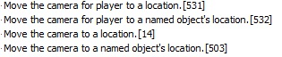
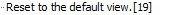
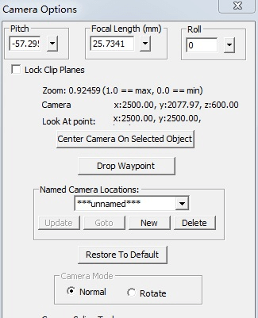
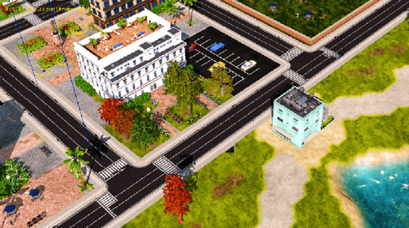
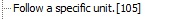

# 【教程】镜头移动技巧

>作者：物wwu

> 熟练的任务图作者总习惯在开头来一段炫酷的镜头来表现战争激烈啊，或者敌人防守严密啊，或者炫耀一下自己的美化啊，下面就从低级用法到高级用法总结如何设计镜头，用到的脚本在Cinematics->Camera里面

>摄像机移动基本是如下几个要素及其组合：摄像机位置，角度，焦距，高度，视平面和地面所成的角度

## 基本移动
               
最基本的镜头移动用法[531]和[14]这两个脚本是改变相机的位置，在地图上用路径点点出1个点，然后camera???选择刚才那个点，相机便会从当前位置移动到那个点的位置，区别在于[531]是移动某个玩家的相机，而[14]是所有玩家的，[532]和[503]是用物体所对应的点代替前面那个点。                 
后面的时间in XXX seconds 填0秒，可用于一开始固定相机的位置。                        
最后那3个时间一般不管。                    
这个用法很常见，官方很多战役有                   

## 变焦
                        
变焦来设计镜头，如官方帝4一开始，这用到脚本 第1个空填焦距，1是标准值，越小越接近平视，第二个是改变所需时间，后面两个不用管            

## 旋转
在一个位置旋转镜头，这用到脚本                       
第一个填要旋转到的角度，第二个填经历的时间               
顺便提一个这个脚本              
这个脚本是绕着当前位置旋转，第一个空填次数，第二个空填时间             

## 边移动边旋转
那么能不能一边移动相机位置一边旋转镜头呢？答案是肯定的，这要用到两个脚本组合                           
                                      
首先用[100]设置相机相关参数，第一个空选点填位置，第二个填焦距,第三个填视平面和地面所成角的参数，这两个参数标准值都是1，最后一个空选点决定相机朝向，即由前面那个点向这个点的方向看。                  
然后用[19],这个脚本不仅仅是移动相机位置，还能把相机的相关参数（角度，焦距。。。）拉回默认值，就是利用这点实现了一边移动一边旋转镜头                    
这个官方帝9用到，2436的苏6,7,8,9都用到     

## 最高级的技巧
上面的方法是有局限的，即最后都是回到默认值，而且不能在连续转两次镜头，那么能不能随心所欲的旋转镜头呢？答案也是肯定的                       
这要用到一开始的脚本[531]和[14]，以及Edit->Camera Options                                
                      

前面选择camera？？？时，我们填的是路径点，但是这个空不仅仅能填这个，还能填包含了所有相机相关参数的相机位置，看到刚才那张图片，Named Camera Locations下有个填相机位置的，
以我的第一张城市图new_top为例，我们在编辑器拉到一个开始视角    

点Named Camera Locations下面那个New创建新的相机位置（如camera1），                   
然后拉到另一个视角                      
点New创建另一个相机位置（如camera2），                      
这样移动相机时，相机便能从第一个视角逐渐变为第二个视角，这之中还可以随意变动最终角度，焦距，仰角，高度等等                      

## 跟随
镜头跟随某物体           
最后一个空填相机比物体高多少              
停止跟随某物体           