# 地图教程

>作者：物wwu

## 玩家（电脑）对玩家（电脑）的攻击优先控制
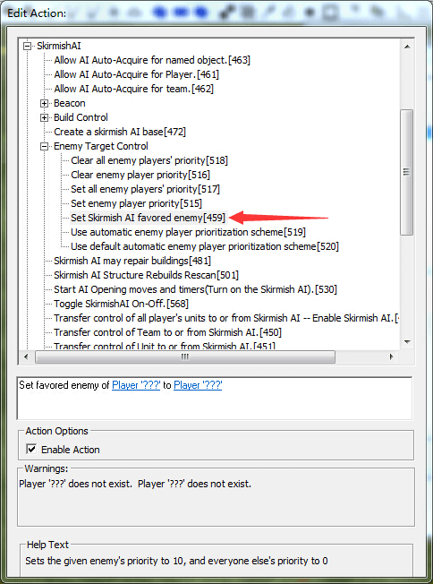               
这条监本可以让某个电脑（攻击者）攻击时只考虑另一个电脑（被攻击者），当然其他电脑若来打攻击者肯定会还击，但是此攻击者打完被攻击者之后就不管其他电脑了。填空：前面填攻击者，后面填被攻击者                                   
为了让电脑打完某个电脑后还会去打其他电脑，就要用下面的脚本设置攻击优先权                      

方框中的脚本即为所要用到的脚本
首先用[518]清除某个电脑对所有玩家的优先攻击权，或者用[517]设置它对所有玩家的优先攻击权，即默认考攻击权，然后用[515]单独设置此电脑对某个玩家的优先攻击权，这样电脑就会按照这个优先权大小依次攻击其他电脑

##  部队巡逻
在我的中级任务教程中已经说了如何让部队巡逻，不过那种巡逻是比较低级的，这种脚本巡逻的部队只会不停地走，而丝毫不会感到累停下来，走走停停地巡逻，这科学么（谜之音:ea科学过么。ea“谁说我不科学了）                        
下面就说如何让部队会走走停停地巡逻                     
在这之前先说个脚本属性里的脚本顺序发生控制                          

方框中的那个勾，就能脚本顺序发生控制

没有勾选这个之前，动作脚本的多条脚本是同时执行的，而勾选了这个之后，动作脚本里的脚本被分割成一条条脚本【顺序执行】，意思就是，动作脚本里的脚本之一条条从上往下执行，只有当上一条脚本失效或完成之后，才会执行下一条脚本

比如，(1)磁暴步兵走到点end1，(2)磁爆步兵攻击敌人的动员兵，（3）磁爆步兵走到点end3. 

那么只要把这3条脚本依次在动作脚本里编辑，然后勾选这个，磁爆步兵就会依次完成这些动作

但如果第二个脚本是磁爆步兵攻击某个点，那么就会产生bug，因为这条脚本并没有完成的标志或者说不会失效，磁暴步兵将一直攻击这个点而不会走到点end2,

填空上，这样的脚本其动作脚本里一般只专注一个单位或一个队伍，所以第一个空选择单位unit或队伍team，后面那个空则天单位的名字或队伍的名字

现在回过头来说如何让单位走走停停地巡逻

脚本属性里                  
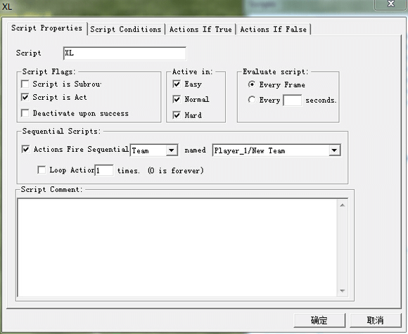

注意要去掉成功后停用让脚本重复执行

动作脚本                  
                

第二条和第四条脚本即是让队伍停留，位置如下

第二条脚本即队伍在end2停留的时间，第四条脚本即队伍在end3停留的时间

## 循环脚本和重复执行脚本
循环脚本很简单，就是在脚本属性里去掉成功后停用前的勾，在右边填写每几秒重复执行一次，如下

上面是选择每2秒执行一次

重复执行脚本与上面不同，已经不局限于一个脚本，而是由2个脚本或更多的脚本通过enable其他脚本来重复执行，打到某些效果，即通过下面这条脚本

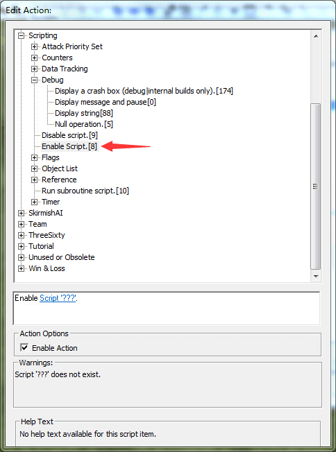

通过这条脚本，可以现实很多效果，下面举几个例子

### 超舞时间，协议时间，技能时间的永久更改              
只拿超舞时间的永久更改来说

先创建2个脚本，分别命名为cw1，cw2

打开cw1，编辑动作脚本，第一条如下

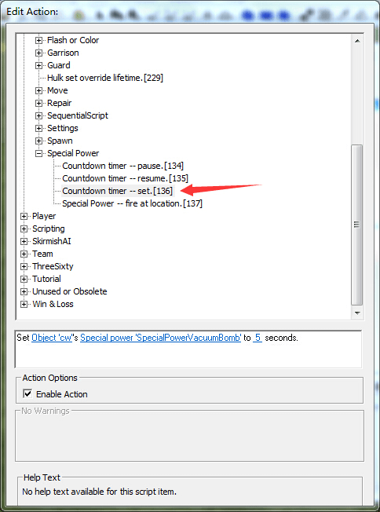

即设置cw这个超舞冷却时间为5秒
完成之后cw1的全部动作脚本

cw1的条件脚本不用动，为true

接着编辑cw2的条件脚本

即当玩家1用了这个超舞

动作脚本

这样超舞的时间就被设置为5秒

更改协议和技能的时间类似，只是第一个脚本里第一条脚本改成设置协议时间或技能时间，

### 建筑物不断重生
比如想让某个建筑一旦被摧毁，经过多少时间后又自动重建，不断重复这一过程

新建2个脚本rebuild1和rebuild2

编辑rebuild1的条件脚本

即当CB这个建筑被摧毁

然后是动作脚本

第一条脚本设置重生时间

然后编辑rebuild2的条件脚本

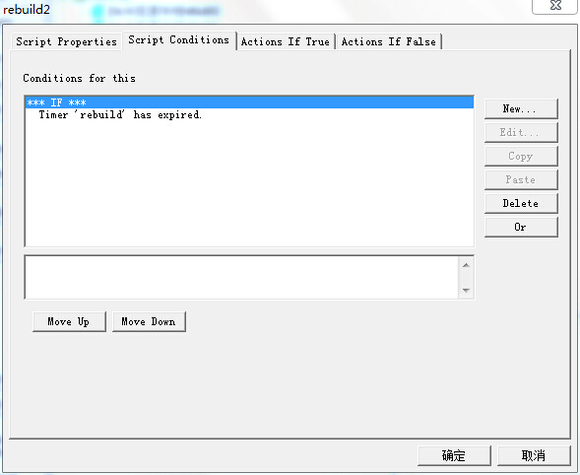

即当重生时间为0

动作脚本，第一条如下

即在spawn这个点产生被摧毁的那个建筑，第一个空填建筑名字，必须和前面被摧毁的那个一样，第二个填建筑类型，第三个填归属，第四个填出生的位置，第五个天建筑角度
完整的动作脚本如下

## 每杀一个兵给钱（给分数类似）          
创建3个脚本

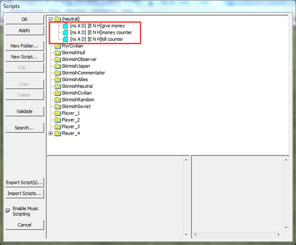

kill counter用来创建杀敌计数器来计杀敌数，money counter用来创建对比计数器，give money用来给钱

思路就是将对比计数器和杀敌计数器比较，如果对比计数器的值低于杀敌计数器就不断不断加1并同时给玩家金钱

打开kill counter脚本，脚本属性里去掉成功后停用的勾让此脚本循环执行

编辑动作脚本

这里只是举个例子，计算的是玩家1杀动员兵的数目，第一个空填玩家，第二个空填要杀的单位种类，第三个填计数器名称，完成后如下

money counter这个脚本很简单，编辑动作脚本如下即可

最后是give money这个脚本，脚本属性里去掉成功后停用让脚本循环执行

条件脚本如下

动作脚本

至此全部完成

## 让ai生产指定数目单位去巡逻
比如让盟军ai拥有的苏联车场每造好5个镰刀就去巡逻

地图准备

给车场命名为WF，画个区域命名为produce

接下来是脚本

新建3个脚本

construct unit脚本就是让车场生产单位，unit ready用来判定是否有5个镰刀在区域内，unit attack就是让镰刀去攻击玩家

首先是construt unit的脚本属性，去掉成功后停用让脚本循环执行，设置每8s点一个镰刀，注意不是每8s生产一个，只是每8s生产菜单里点一个镰刀

动作脚本

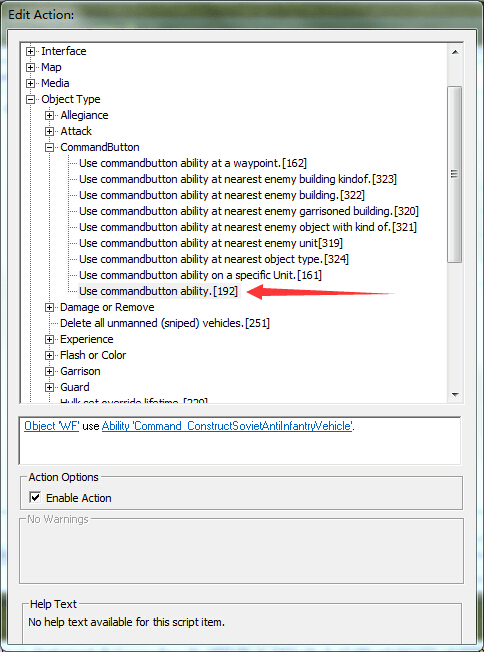

然后是unti ready这个脚本

依然是让脚本循环执行

条件脚本如下

即若在区域里有5个镰刀

动作脚本

即执行unit attack脚本

注意，还没完，若不够5个镰刀。即不满足条件，要禁止unit attack脚本

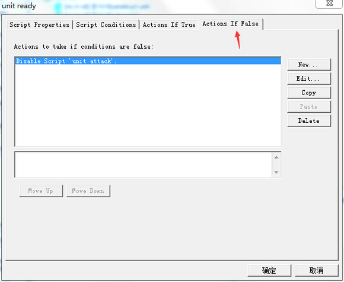

>作者：物wwu

最后是unit attack脚本    

依然是让脚本循环执行，不过还要禁止脚本

动作脚本

先命名

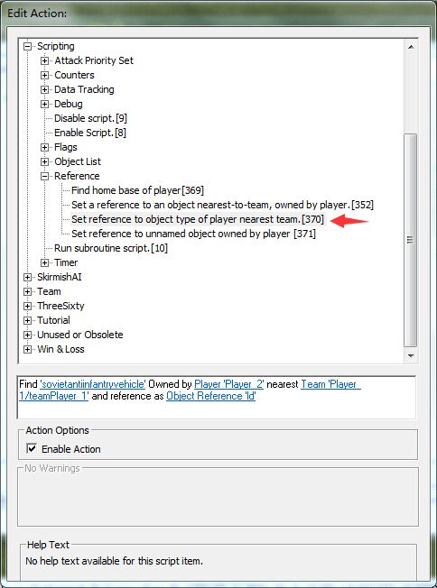

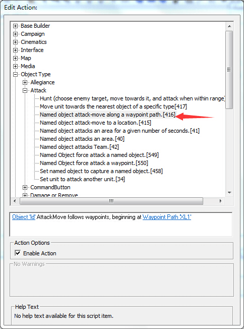

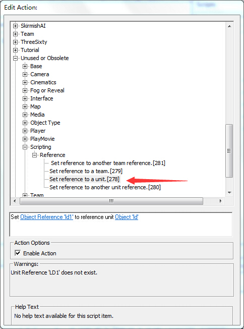

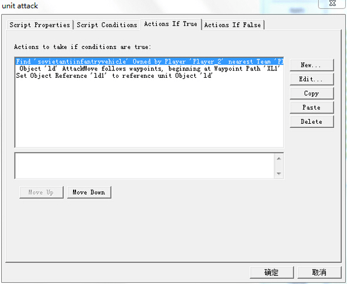

至此全部完成

---

上面的方法有些繁琐，下说个简单的，不只是巡逻，攻击之类的也能

比如车场每造好5个镰刀就去打玩家

先把车场归属到要攻击的队伍里

只需要2个脚本，construct unit和team attack

construct unit和上面一样

team attack的脚本

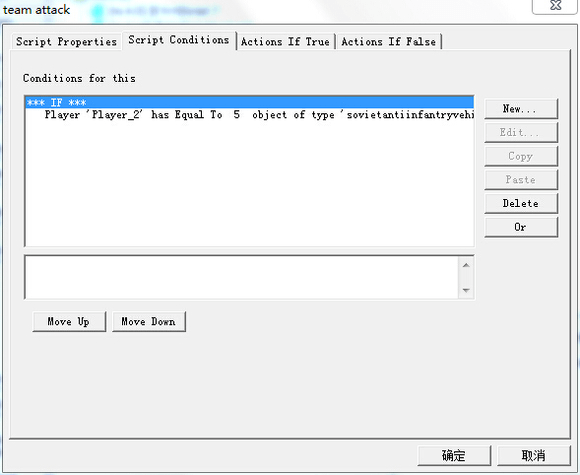

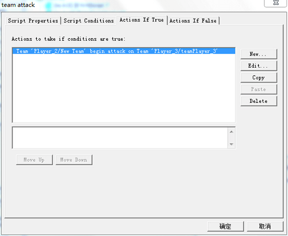