# 塔防地图制作基础

> 作者：物wwu

塔防地图从目标上大致可以分为三类：
- 阻止单位到达某区域
- 防守自己的基地
- 防守特定东西

##  第一个目标类型的塔防

这种塔防的地图是让单位沿着特定路线走

可以选择单位在行进过程中攻击玩家或者不会攻击

这种塔防图单位行进要用到的脚本如下

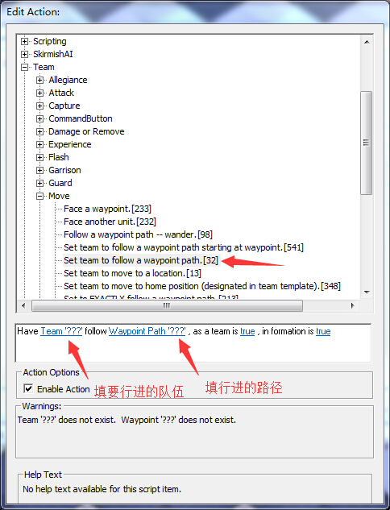

注意最后两个要选择true

行进的路径用路径点工具拖拽形成，然后命名路径

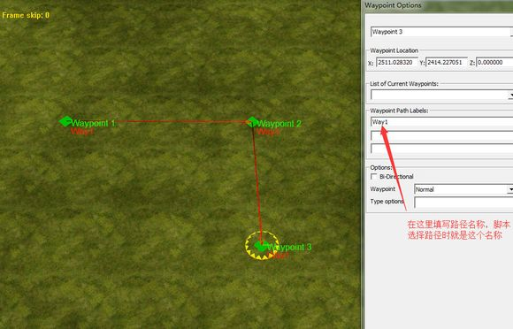

若要让单位行进过程中不攻击玩家，要在物体属性里这样调

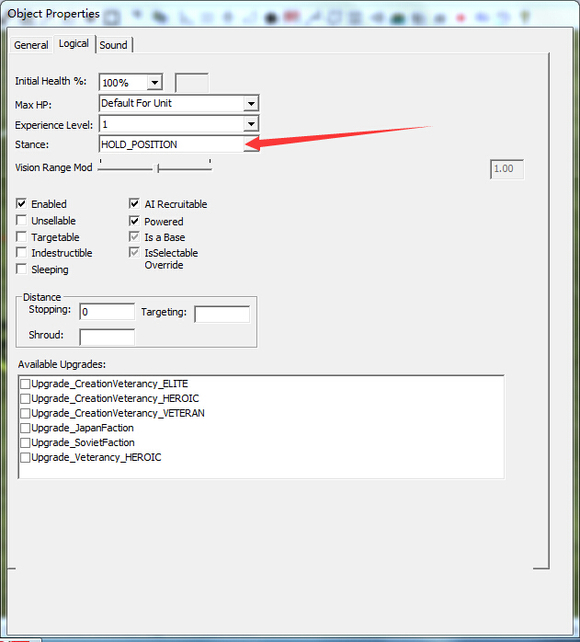

### 关于队伍的产生
- 可以事先在地图外摆单位（注意将每一波的单位重叠放在一起），然后将单位归属到一个队伍，添加新队伍的方法：
点这个按钮

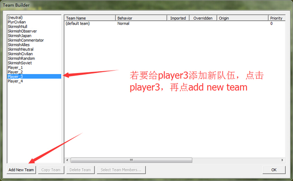

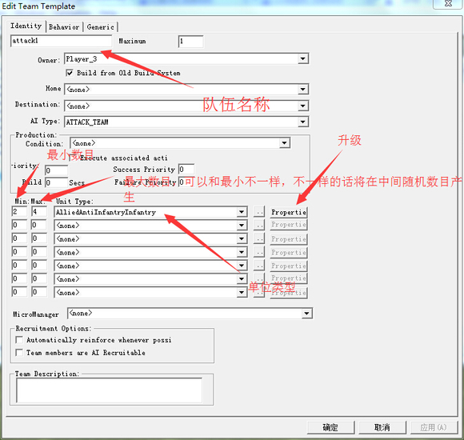

> 当然可以不添加任何单位，而通过将地图上的单位归属来添加队伍成员

归属在这里选择

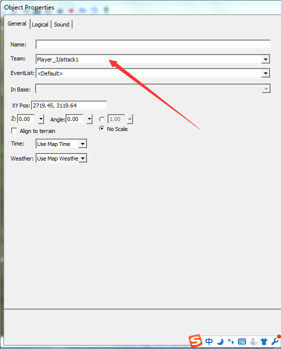

也可以用脚本产生队伍

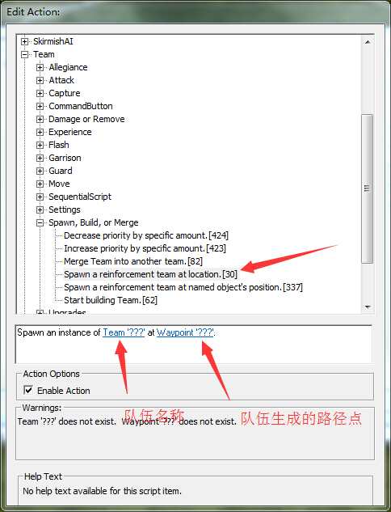

不过要注意队伍生成是一行行的，而单位沿着路径走可能会偏离，所以最好加上下面这个脚本吧队伍传送至一个点

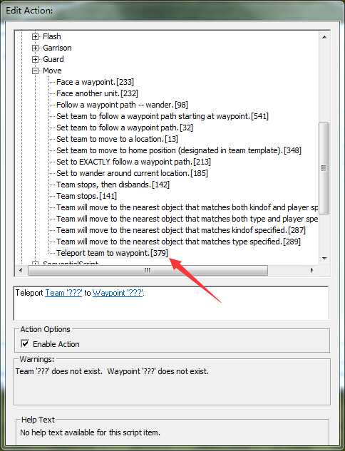

>最好把队伍传送至地图内，因为地图外的单位进入地图内有可能会卡住

这种塔防失败的脚本条件为

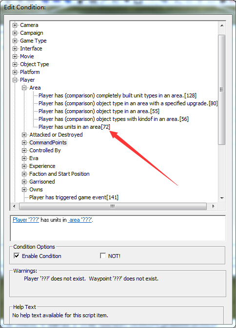

后面那个空填区域，区域用多边形工具画

## 第二种类型的塔防

进攻单位有以下5种攻击方式

### 直接让单位去攻击玩家

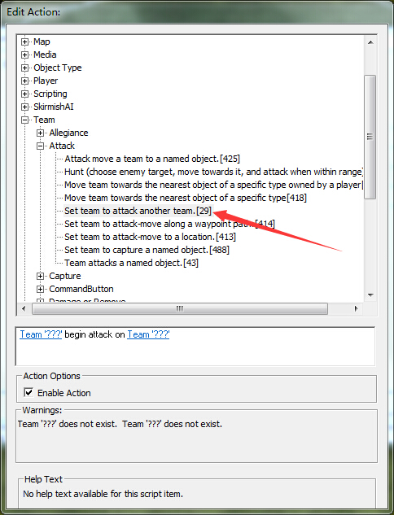

### 让单位沿着指定路径去攻击玩家

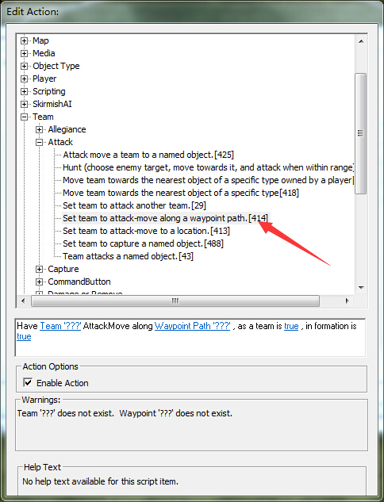

### 让单位一边前往某一地点，并攻击沿途遇到的敌军

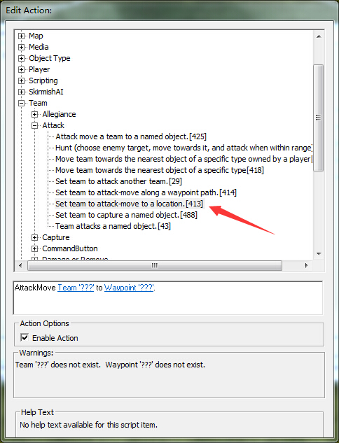

### 让单位前往某一种物体，并攻击沿途遇到的敌军

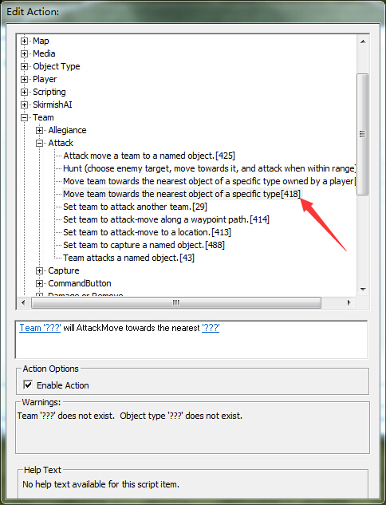

### 上面那几个攻击方式不能让单位非常灵活，比如躲避协议超舞，会用技能等，下面这条脚本则可以让单位会这些

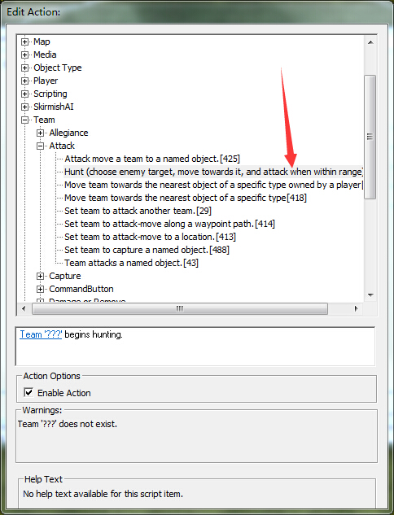

### 技巧

每次攻击都加上这几条脚本非常累，可以在将攻击方式的这些脚本作为子脚本，方法是在脚本属性里勾选这个

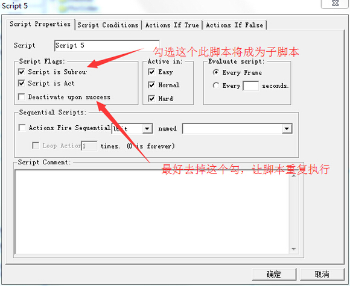

然后在队伍设置里选上这条脚本

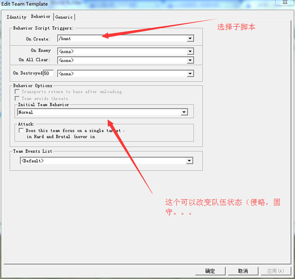

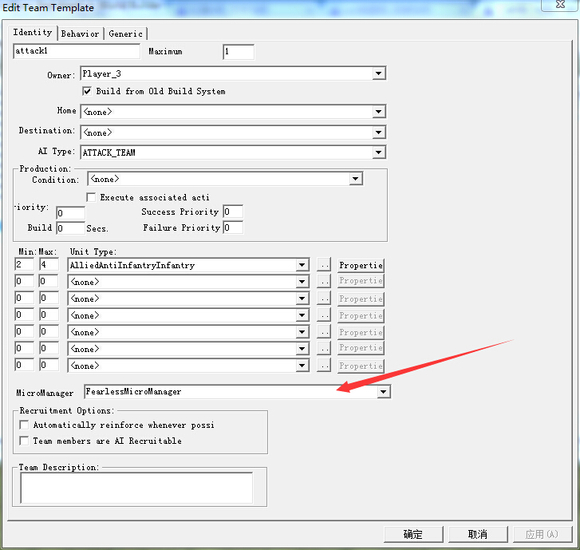

这里可以改变队伍的微操

最常用的两种 FearlessMicroManager 无畏惧

StandardMicroManager 单位会进会退

还有各种类型的单位的微操

BomberAircraftMicroManager 轰炸机的

FighterAircraftMicroManager 空优战机的

TwinbladeMicroManager 双刃的

TanyaMicroManager 谭雅的

还有战役中的单位的微操，不过我没具体试过

## 最后一种塔防

进攻队伍可以分为两类，攻击玩家的（用来拆玩家的防御）和用来拆特定建筑的

攻击玩家的就用上面那些脚本

拆建筑用下面这个脚本

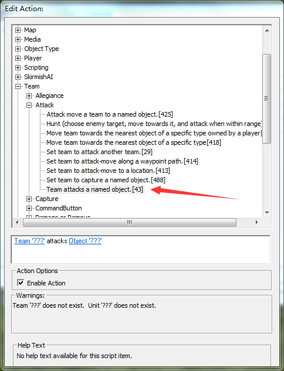

这种塔防的失败条件是特定东西被毁

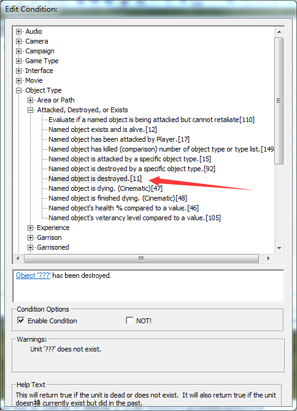

