# 任务目标显示隐藏

## 首先讲显示吧

看到我们[刚刚](../创建和编辑任务目标/创建和编辑任务目标.md)创建的内容 保护盟军总部。 首先 找到类似盟军总部的东西 然后命名。

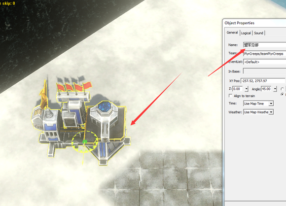

打开脚本 看到interface-objective. 看到405 和407号脚本。 这2个都是显示任务目标的。 不过一个是显示在路近点上（406），一个是显示在物体上（405）。

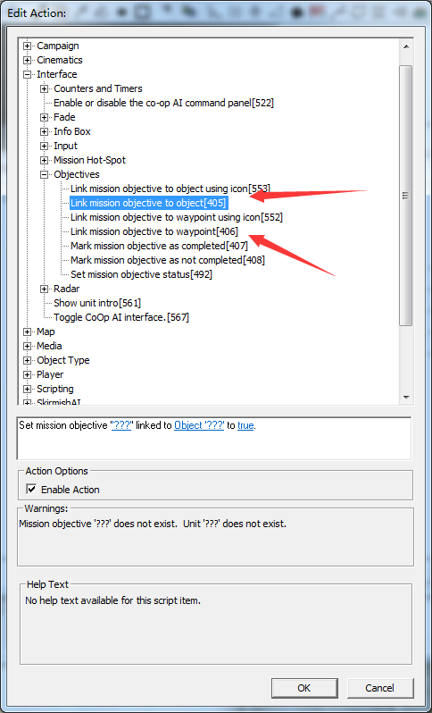

就把刚刚创建的任务目标显示在盟军总部上吧。看到object的脚本405 第一个空填创建的任务id 第二个填物体。 第3个填true（false可以当做反脚本来用 就是隐藏任务目标）

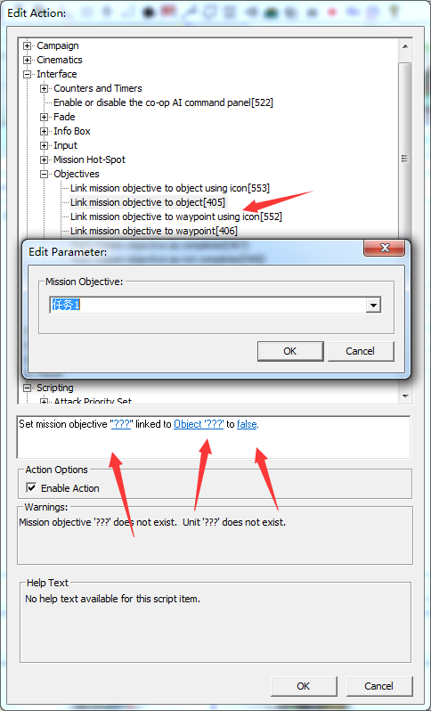

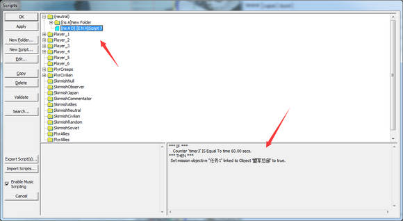

这样一个任务目标显示就完成了。（记得加你要的条件哦）

## 任务目标隐藏

当目标完成时 我们需要去掉他。 方法有很多

### 方法1

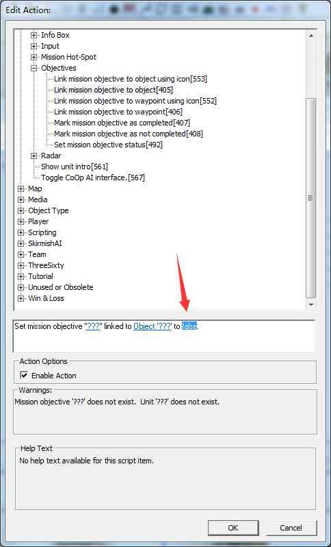

可以用反脚本进行反向

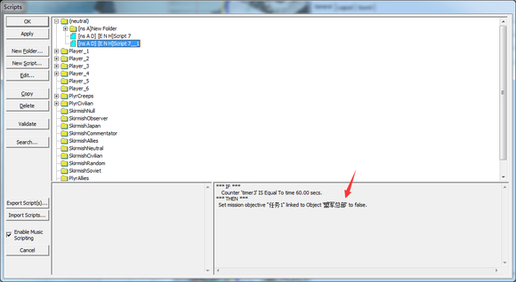

### 第二种

直接隐藏 看到492号脚本 第一个空填任务的id 也就是你在obj设置的那个。 第二个填 hidden（隐藏）

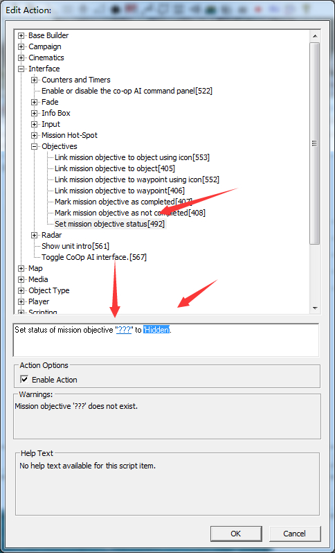

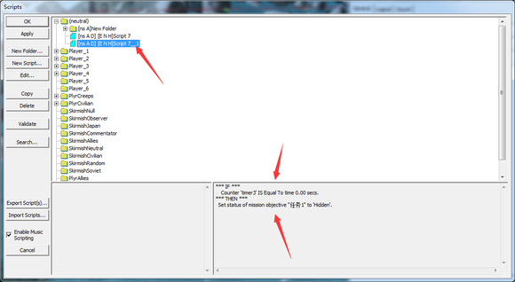

还有一种 就是停止脚本。（脚本有活跃的，也有不活跃的。我们需要吧任务目标显示的脚本改成不活跃状态）我们先给加了任务目标的脚本取个特殊的名字吧

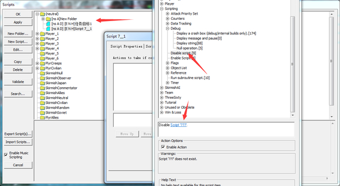

那个空填你要停止的脚本

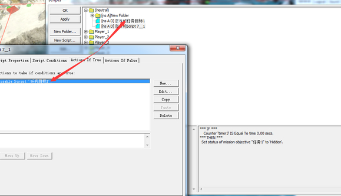

## 任务目标的提示 完成提示 失败提示

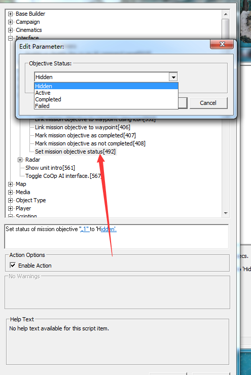

没错就是492。 按照刚刚那个例子，防御盟军总部。 加适当的条件（比如当任务目标出现的时候 改成active 这样就会有提示）（加完成的条件） 完成的时候 completed。

