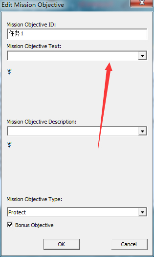

# 创建和编辑任务目标

首先打开这个obj


得到以下界面。


点击new 创建一个任务目标。


A 是这个任务的名字 方便你区分，英不英语无所谓 只要你能区分就行了。跟游戏无关。就像前面讲的命名一样。 B是任务目标内容。后面会讲。 c是任务目标显示的类型 （游戏中显示的图标 ：攻击 防御 建筑） D如果勾了 绿色的任务目标图标就变成黄色的。（黄色的任务目标一般都是额外任务目标。。官图一般都这样）

那我们就来创建一个任务目标吧。名称：任务1 类型 ：额外任务（防御）


内容嘛。可以自己创建，也可以用官方的任务目标。

不过自己创建的只能是英语的。用官方的就可以是中文的。


打开后 如下。A指的是盟军 后面的 数字是战役的关卡。 A02-后面的就是任务目标的次序喽。（除非你对官方战役很熟悉，不然很难找到你要的任务目标）


当你点下一个内容时，下面就会显示该任务目标的内容。看不懂找度娘去。 记得 2个内容上下要保持一致。

然后按ok。就创建好了。


不过还需要用脚本让才能让它出现。（参见[这里](../任务目标显示隐藏/任务目标显示隐藏.md)）

## 编辑自定义任务目标的内容

去地图文件夹找到map.str (没有的需要自己创建)。

输入格式如下

```text
MISSIONOBJ:任务目标id
"任务目标实际内容" 
End
```

例如


刚刚我们不是创建一个保护的额外任务目标吗？ 内容id ARW1 内容：保护盟军总部

好了 记得保存和切下图。不然地编里会看不到。

回到地编


打开我们干才创建的任务目标。



找到刚刚创建的任务目标内容id ARW1


意上下保持一致。 好了 一个自己编辑内容的任务目标就完成了。


