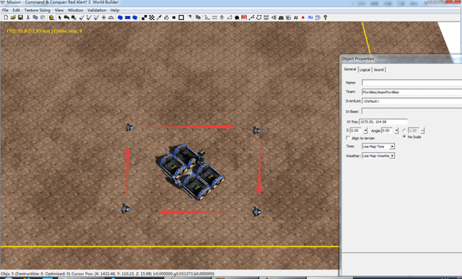
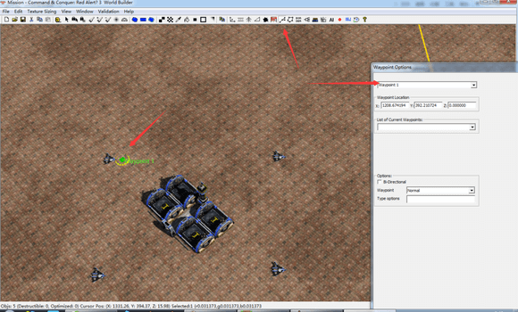
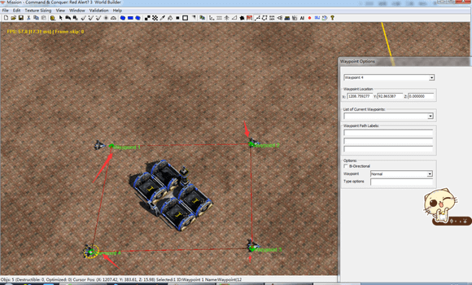
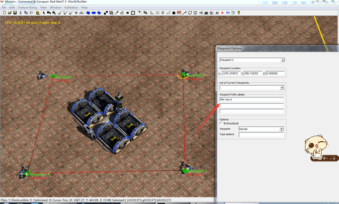
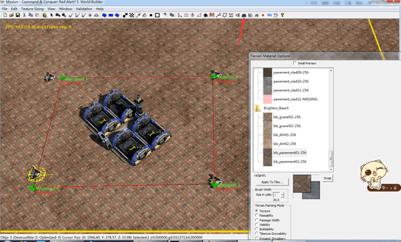
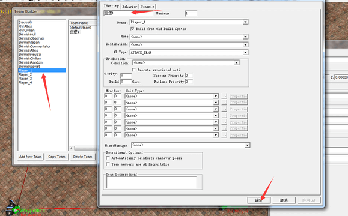
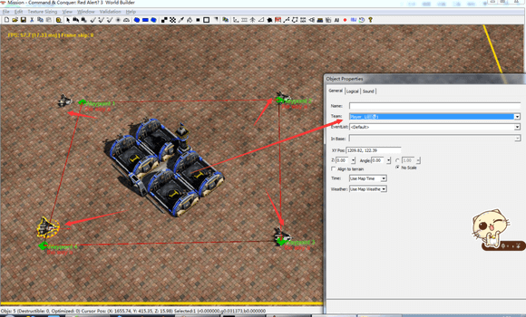
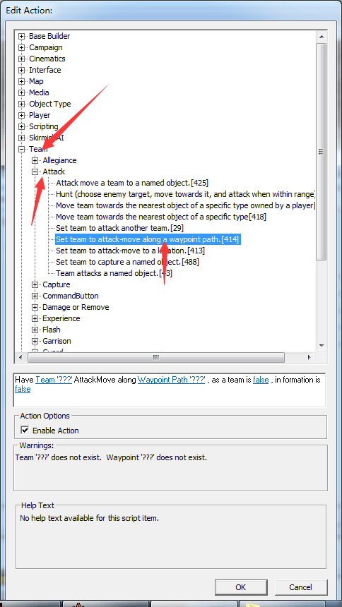
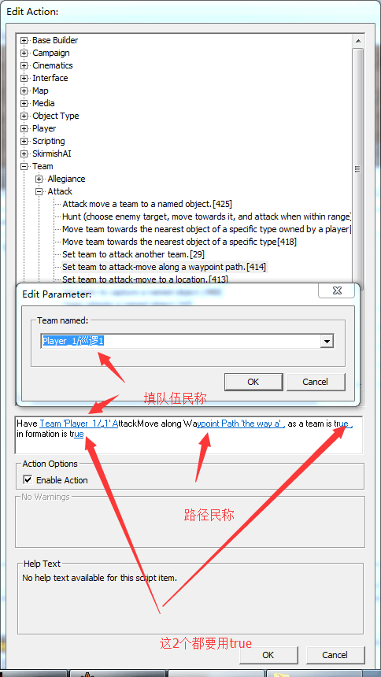

# 巡逻

一般都是用队伍巡逻的。不过也有用一个一个的物体巡逻。先讲队伍吧。

先放好你要巡逻的单位，如下图 我想让这4个阿波罗绕着机场巡逻。

看到路近点工具。没错就是弄基地出生地的那个。

先点一个点，然后拉。（别告诉我你不会拉= =点完一个点后，在黄色的圆圈里拉出来。）

这样一条巡逻路径就弄好啦（要注意下路径的箭头指向，要构成闭合回路，不然就不会饶着这个圈巡逻）

然后给他命名，我暂时叫他路径a吧。

接着创建队伍，让4个阿波罗都归属一个队伍。看到这个好几个人头的标志，就是队伍栏。

那我就创建一个 叫 巡逻1的队伍吧。（其他的东西先不用管，后面会讲到）

然后让着4个阿波罗归属队伍。（其实和命名差不多，可以理解为然这4个∈一个集合，然后再让这个集合一起动作）

接着加脚本。看到team-attack-414号脚本

好多个空啊。第一个填 队伍名称。 第二个填路径名称。 第3,4全部要填true。

注意脚本是attack move 就是在移动中攻击 所以弄成一个闭合和回路，就是巡逻啦。 如果是不闭合的就是进攻。

好了 一个巡逻就搞定了。
