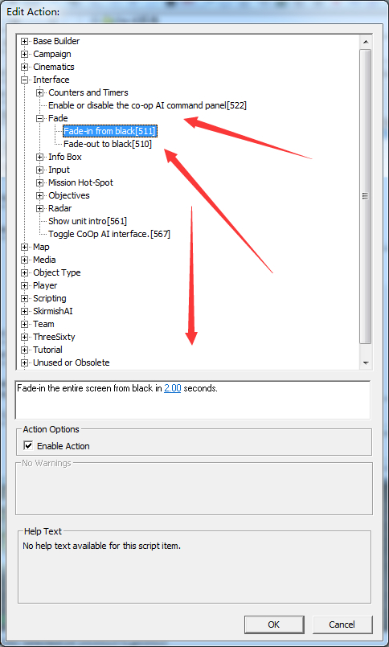
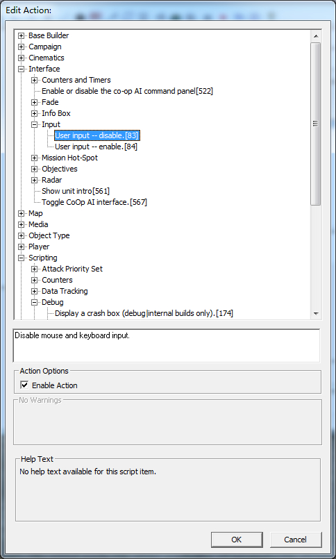
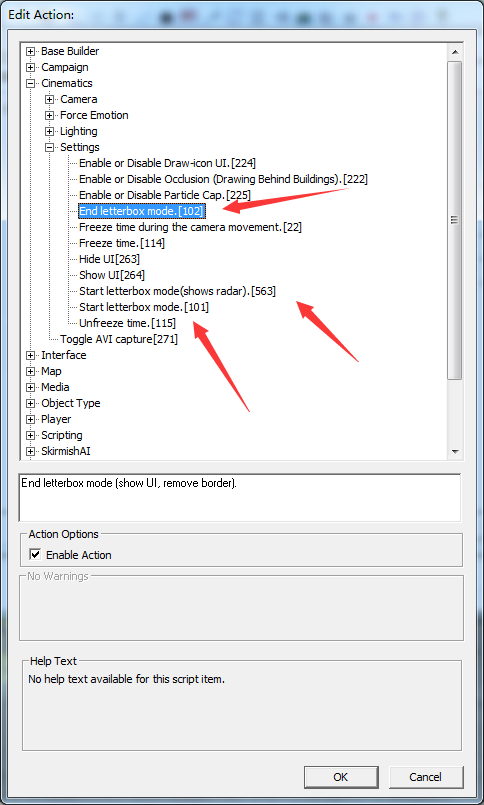

# 电影模式和淡入淡出黑幕

一般任务的摄像头会从黑幕中出来。或者摄像头的结束会黑屏。下面是进入黑屏和离开黑屏。

下面的空填进入和离开的时间。

限制摄像头移动的时候鼠标键盘

用到83和84 一个是禁止 一个是允许。反正一个是用来解除的。

电影模式 就是镜头上面和下面会有一块黑色的，看起来就像电影。

101 563 是开启电影模式。563 是带有雷达。如果需要播放视频就用这个。

102是退出电影模式。

