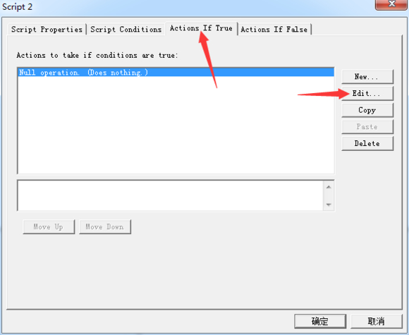
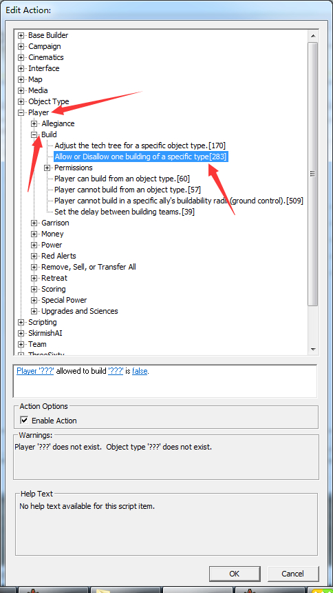
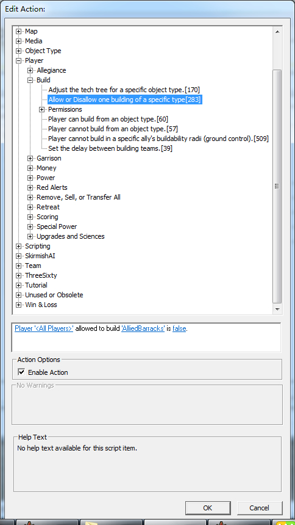
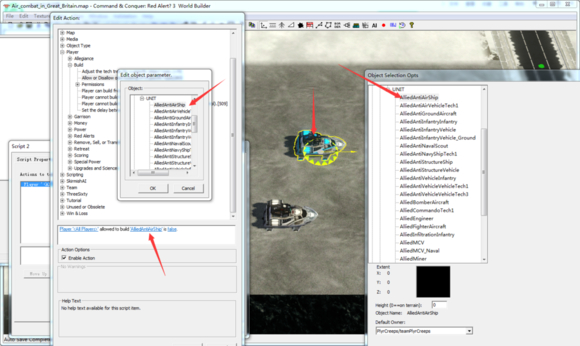

# 科技限制

按编辑（新建也可以）　可以看到那个脚本是ｄｏｅｓ　ｎｏｔｈｉｎｇ（啥都没做）２３３３那我们来做点什么吧。

点击编辑，点完编辑会的到一个全是脚本的框。找到ｐｌａｙｅｒ　打开　再找到ｂｕｉｌｄ，打开得到以下框。

以你初中的英语水平试着翻译下，ｐｌａｙｅｒ什么（是否）被允许去建筑什么。

大概懂了吧＝＝估计你没懂。。　来对应以下　第一个空就是玩家什么　　第二个空就是允许建筑的东西

第３个就是（是或否（这里留意下　因为可以作为反向脚本　后面会讲到））

那我们先来限制下所有玩家的盟军兵营吧。　点开第一个空　填ａｌｌ　ｐｌａｙｅｒ　第二个空你会发现是一个建筑列表，其实那个跟物品栏里面的是对应的，所以可以参照物品栏的物品来选择你要的东西。在末尾演示一下

第３个填ｆａｌｓｅ意思是否。

这样科技限制就成功了。

同理这个也可以限制单位。 不过注意，要限制日本建筑得限制核心车 不能限制建筑 不然无效。核心车在单位那一栏unit那里。

用列表的对照的演示：

