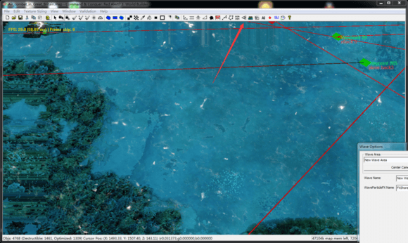
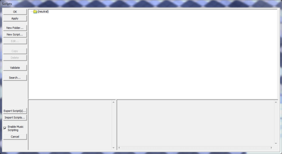
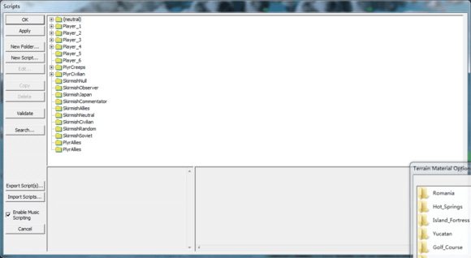
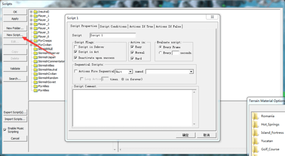
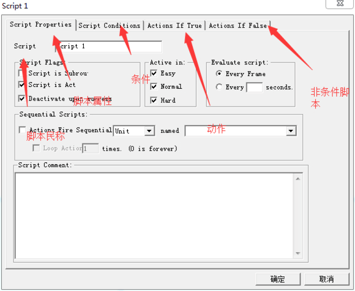

# 脚本的添加和介绍

首先,如何添加脚本,首先看到这个分叉的标志（有点像树状图）

点开　得到以下界面

是不是少了点什么。没添加遭遇战玩家。

咦　为毛这个这么多文件夹呢。。。。没关系　文件夹只是起了分类作用。。。脚本不管放在哪个文件夹　效果都是一样的。　点击添加脚得到以下界面　

英文呐。。。　　我来初步介绍下各个部分的作用。

脚本民称可以随便命名中文也可以　前提那是干嘛的你要记得　方便修改添加脚本。其他的东西以后再讲　暂且用不到，以后会介绍。

条件　就是脚本触发的条件　一般默认情况下是ｔｒｕｅ　初学者可以先不管　以后会讲到

动作　就是会发生的事

非条件　这个可以不要管

打个比方　　当你走进教室　同桌就会揍你　ｉｆ　条件就相当于前面的　当你。。。　动作就相当于后面的同桌揍你２３３３

有时候脚本可以没有条件　但必须要有动作。　