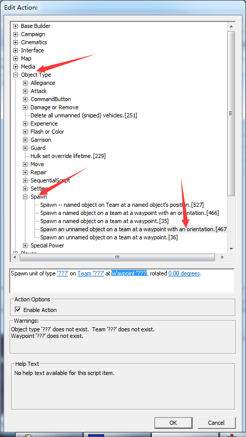

# 计时器的使用

计时器应用：时间触发的条件脚本。 到一定时间在地图上建造建筑

计时器。。。这个是重点。 要是有了这个 做个塔防出来完全没问题了。任务也应该差不多啦。

可能会有点难理解。。

首先计时器是什么？ 你可以暂时理解为给一段时间命名，如何选取其中一个时刻，触发动作。

打个比方吧 就像一张时间表，规定一段时间，在哪个时刻做什么。

规定一段时间就相当于 设置计时器。 在哪个时刻 就相当于到那个时间点触发的条件。

先设置一个计时器吧。 （假设我们要在开局20s后 在a点出现一个正在建造的重工）

## 看到动作脚本

第一个空填计时器的名称，第二个填倒数的时间。

一个计时器就设置完成了。

重开一个脚本。还是和以前一样 条件+动作

条件 第一个空填计时器。 第二个空填关系 （＞ = ＜ ≤ ≥）不过一般用= 也就是equal to 等于。 后面填时间。

## 条件

填时间的时候要注意，因为计时器是倒计时，所以时间也要反过来。 需要做个减法， 计时器设置的时间-第3个空填的时间=你要的时间。

打个比方吧。
倒计时60s 在开始倒计时20s的时候 你要喝杯水。

请问 这个时候倒计时是多少秒。

40s。。

计时器也是这样 本质上就是个倒计时。

所以 如果我们要在开始计时的20秒后 出现个正在建造的重工就要填120-20=100s

如何弄出一个有建筑过程的建筑呢？

记得创建玩家哦。

先点个路近点

然后打开刚才设置了时刻触发的脚本。 看到动作脚本467. 第一个空填物体。 第二个填玩家 第3个填出现的点（也就是你刚才设置的路近点） 第4个空填角度。

盟军重工的位置如下。同样 这个动作脚本还可以出现其他东西（单位 建筑 刽子手。。）

角度一般都是填 45 -45 135 -135 因为游戏里的角度都是这样的。

看下总体效果吧。 20s 出现一个重工就完成啦。

看看整体图。

注意 开局就有的计时器 前面一般不加条件。（一个计时器还可以去触发另一个计时器）

这个也是关于计时器的条件触发。 意思是 这个计时器结束，就触发。 不过一般用的是82号脚本

