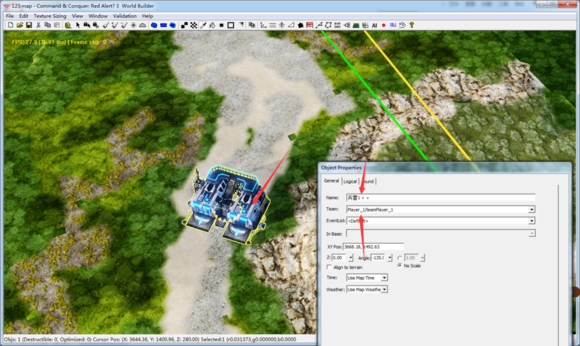
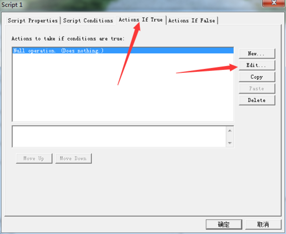
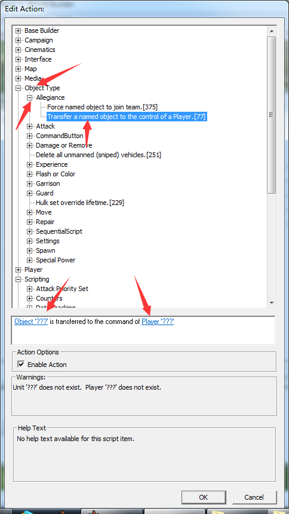
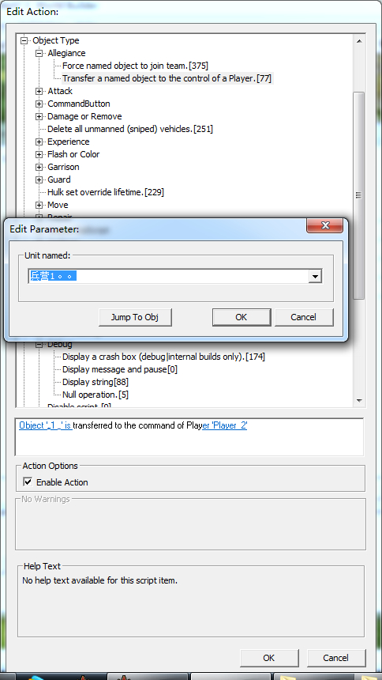

# 让AI使用放在地图上的建筑

把一个兵营放在地图上 然后设置归属 会发现电脑死活不肯用。 咋办呢。加脚本呗。进入正题。首先 先给兵营设置归属 某个玩家，再给兵营命名 注意不是取名 游戏里看到的名字跟这无关。

命名完成后打开脚本 新建 看到动作脚本

打开后展开到object-allegiance

出现2个空格。第一个填 命名的物体 ，第二个填归属的玩家

然后就完成了。记得按ok 和保存。 就这么简单23333