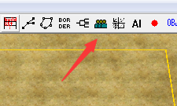
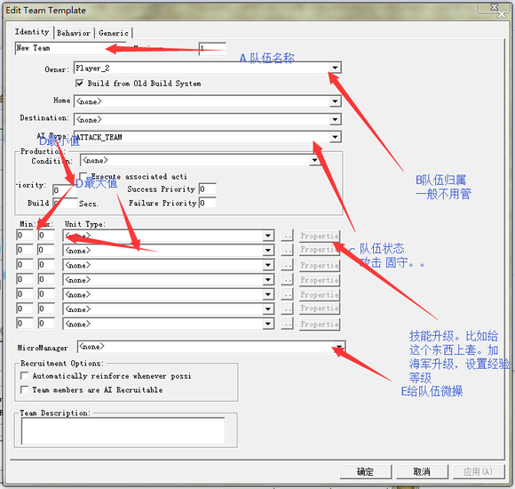
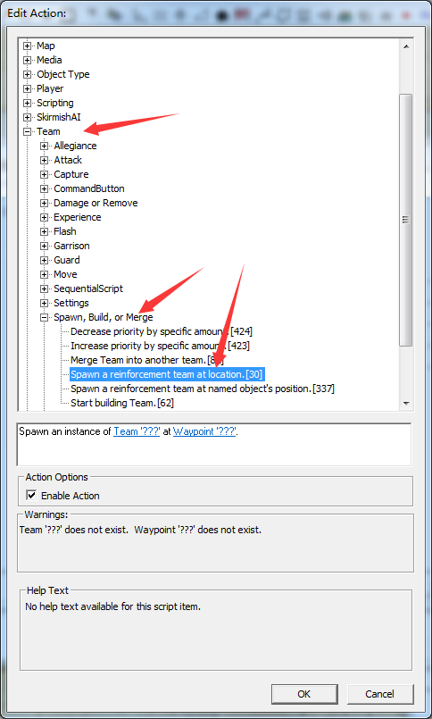
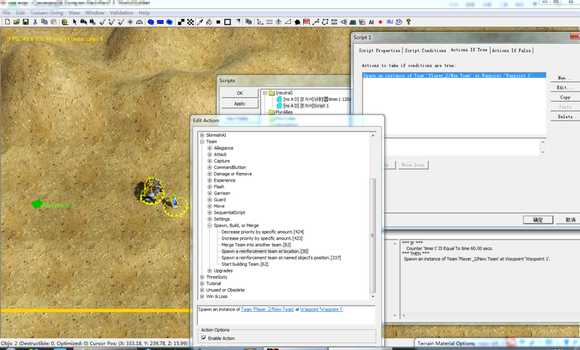

# 队伍编辑和生成队伍

上图的按钮就是用来添加和编辑队伍

D最大值不能小于最小值。你懂的 ∅。

给队伍微操 这个以后再说，对塔防刷兵作用很大。 有战役微操，飞机微操。。。

none的部分是选的兵种。

接着就是加脚本让这个队伍出现喽。

跟物体的spawn一样。 第一个空填你要出现的队伍，第二个填你要队伍出现的路近点

更多使用参见[这里](../../塔防地图制作基础/塔防地图制作基础.md)
