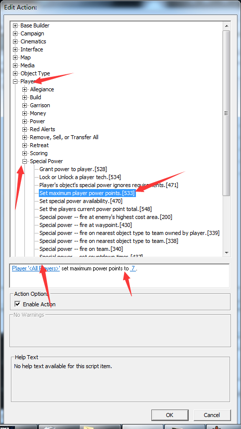
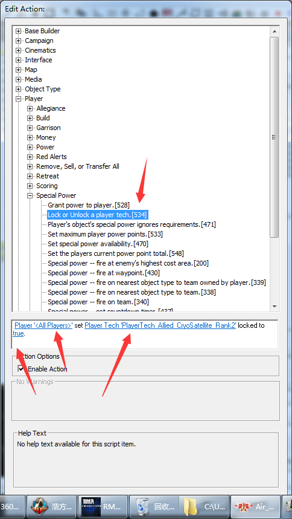
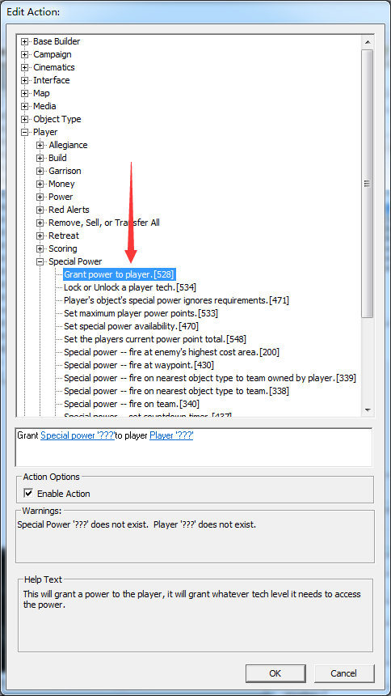
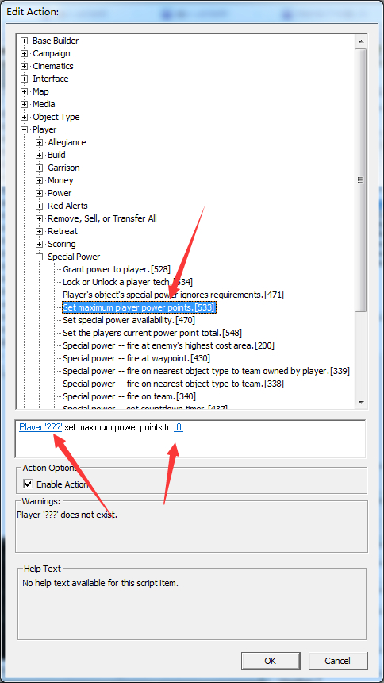

# 限制协议-获得协议-限制协议点上限

限制协议上限 player-specal power 533号脚本 第一个空填设置上限的玩家 第二个填上限的点数。

限制协议 534号脚本 。第一个空填脚本作用玩家 第二个填协议 第3个填（是）自己翻译一下就明白了。

顺便提一下 同样这个也可以当做反脚本：开启协议 后面讲完计时器后会将。（在下一楼我会给出协议的翻译）

给某个玩家协议。不过必须要有那个阵营的基地才能使用。 看到528号脚本 第一个空填玩家获得的协议 第二个填玩家

设置玩家初始技能点数。第一个填设置的玩家 第二个填协议点的数量。

