# 添加自定义战役进官方战役里

>作者：物wu

>其实就是替换官方战役，需要有mod制作的基础知识

请先确保你有一下基础：
- 会做一张像样的遭遇战战役地图，包括玩家列表的更改，会添加脚本，对脚本比较了解
- 有一些制作mod的基础，比如添加地图进mod，会修改一些局部数据

关键的xml：CampaignTemplates.xml和MapMetaData.xml

修改如下

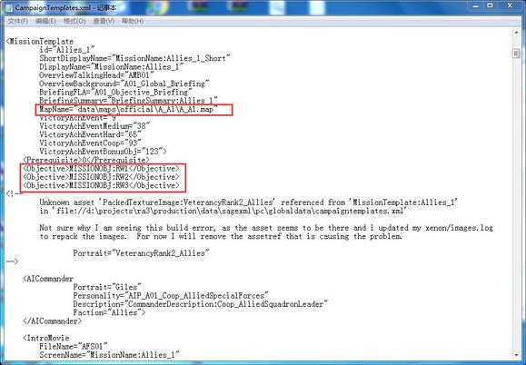

第一个是修改地图名字，第二个是修改任务目标，这里我新建了3个新的任务目标，具体内容可到gamestrings.csf里修改

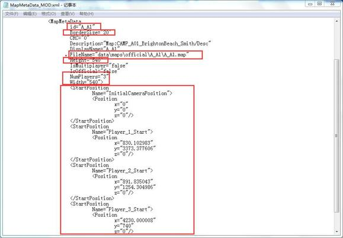

这些地方也需做修改，startposition和borderSize这些数值可到自己地图里的map.xml里搜索MapMetaData看到

要在MapMetaData.xml里注册CampaignTemplates，也就是在MapMetaData.xml里面添加以下代码：

```xml
<Includes>
<Include type="all" source="CampaignTemplates.xml" />
</Includes>
```

然后弄放好源码和地图

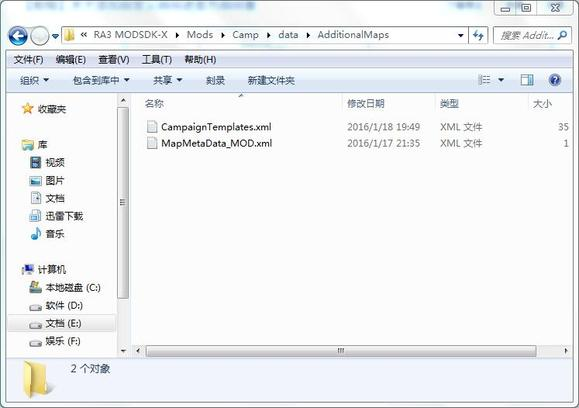

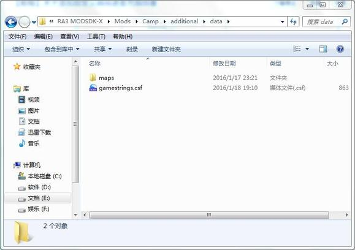

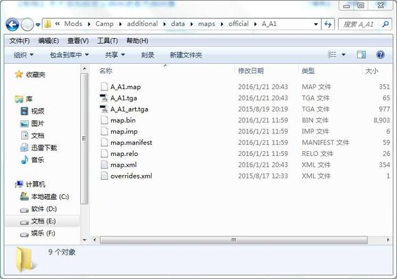

到这里，添加战役的主题流程就已基本结束

剩下的是一些地图设置和ai等等的细节

官方战役地图的玩家列表和脚本和遭遇战的有些不同

首先是玩家列表

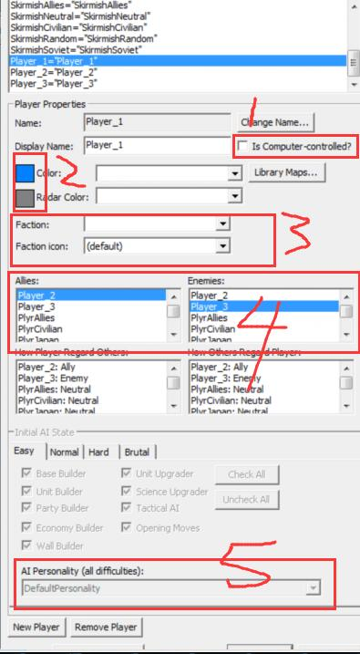

- 这个选项决定了是否为电脑控制，官方战役里，除了主指挥官外，其他玩家都应该勾选，包括副官
- 这里选择阵营颜色以及雷达显示的颜色，
- 这里必须选择与该玩家符合的阵营名称，如不选则雷达将一直处于关闭状态
- 这里选择敌友关系
- 电脑控制的玩家这里要选择一个性格，不能是DefaultPersonality，至于应该如何选择，后面再说

战役里玩家名字可以任意起，只要按照上一楼的规则来就行

关于让电脑会使用建筑和部队，遭遇战里的transfer脚本已经没用，要用以下这条脚本

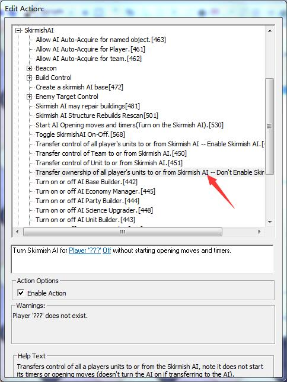

并且，每当有新的建筑要让ai使用，就要加这条脚本

需要注意的是，这条脚本会让ai使用所有已经在地图上属于他的东西，包括地图外的要进攻的单位，所以，若

要让地图外的电脑单位按照脚本进攻，就必须再设置一个玩家，这个玩家专门控制这些进攻部队

现在说一下ai问题，编辑器的玩家列表那里可以选择ai性格基本都只会防守，所以，若要让ai按照预定的方式进攻，就得自己设计ai

以设计一个盟军ai为例

步骤如下：

1

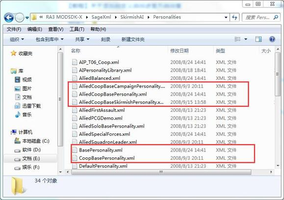

先要复制这5个文件到自己的mod文件夹里

2.然后打开AlliedCoopBaseSkirmishPersonality.xml，用这个做模板做新的ai，修改他的继承和id

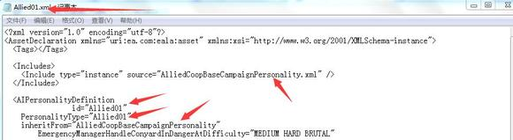

id可以自己随便起个名字

3

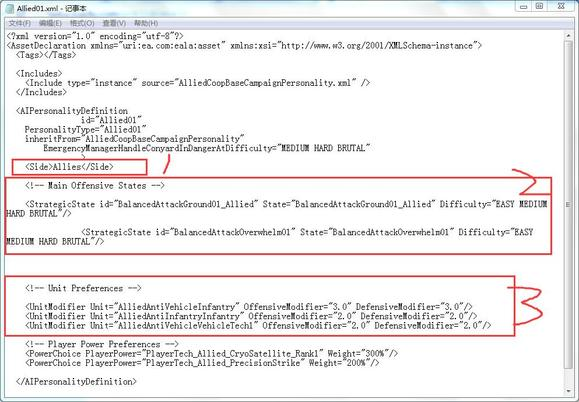

必须加上<Side>Allies</Side>这行代码，然后Main Offensive States下面是这个ai的进攻策略，

Unit Preferences下面是调节这个ai喜欢出哪些单位

关于进攻策略，不能只是修改策略文件的内容而不修改策略的id，这样会导致闪退，策略文件的位置如下

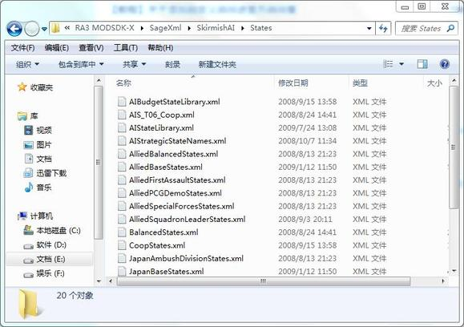

最后说一点注意：地图里不要出现中文！！！非常重要，否则地图打包不会成功

最后放个替换成功的截图

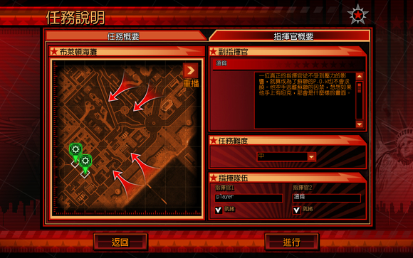


