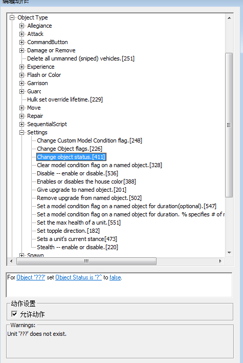
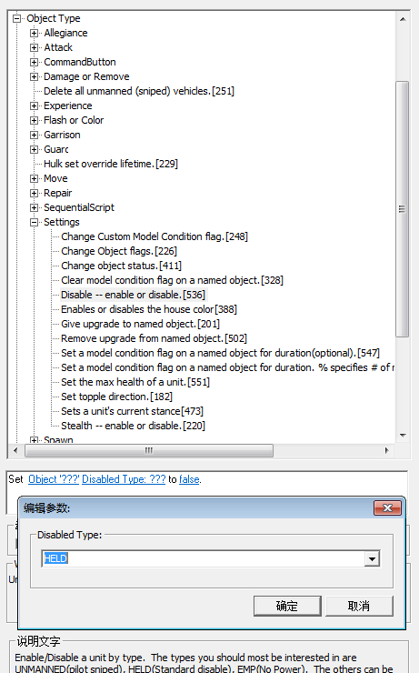

# 设置物体状态的用法

>作者：小强

设置物体状态就是比如，可以设置一些物体能攻击，不能被攻击，能选择，或者不能被选择等等。。。包括做出一些变态的单位，比如把单位，或者是建筑放进迅雷车，让里面的单位可以使用技能，能攻击。当然还包括防御塔不用充能，波能不用充能，能瞬间攻击，提升攻速。标枪F不用引导等等。

先说411脚本吧，这里面有200多项物体状态，但是我也不是全部都懂，只会一部分

NO ATTACK

IMMOBILE

这两个加在一起，把值设为假，可以做出迅雷车里面的单位可以攻击

UNCONTROLLABLY SCARED（这个可以免疫百合子攻击）

MOVING TO DISMOUNT（这个可以空中单位变成地面单位，也就是说飞机在地上跑，但是不受地形限制，虽然很滑稽）

OVERCHARGING WEAPON（这个可以波能，磁暴线圈，等一些单位变成0攻速射击，挺变态的，至于哪些单位可以自己试试吧）

UNATTACKABLE（这个是不能被攻击，包括桥梁无敌也可以用这个，但是桥梁要通过队伍里的状态设置才能实现无敌）

再补充几个 SPECIALABILITY ACTIVE（这个可以把鬼王和将军舰变为近身攻击，伤害跟F等同） DEFLECT INCOMING FIRE（这个可以让单位弹开一些有弹道的攻击，效果还是很好看的） SURFACED（设置值为真） SUBMERGED（设置值为假） 这两个加到一起可以让潜艇和海翼取消攻击前摇

STEALTHED HIDDEN 这两个是可以设置物体为隐身状态，像幻影一样，可以攻击电脑，但是电脑不会打你

UNDER IRON CURTAN（这个可以免疫一些炮弹类型的伤害，和大部分控制效果，包括白合子的升空效果都可以免疫，但是会受到伤害）

然后再说536

EMP（这个就是免疫航母F等一些瘫痪效果的，记得循环每贞）

HELD （这个的话如果想让迅雷车里面的航母攻击，和其他单位使用技能必须加这个，值设为假）

UNMANNED （无人驾驶的 ，就是设置被娜塔莎F过后的效果）

这是我常用的，其他的没怎么用，也不敢乱说

411这个脚本在队伍里可以可以找到对应的脚本是412，可以批量设置。但是536这个脚本在队伍里面没有，所不能批量设置

